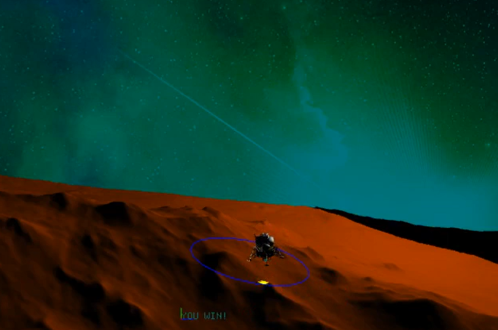
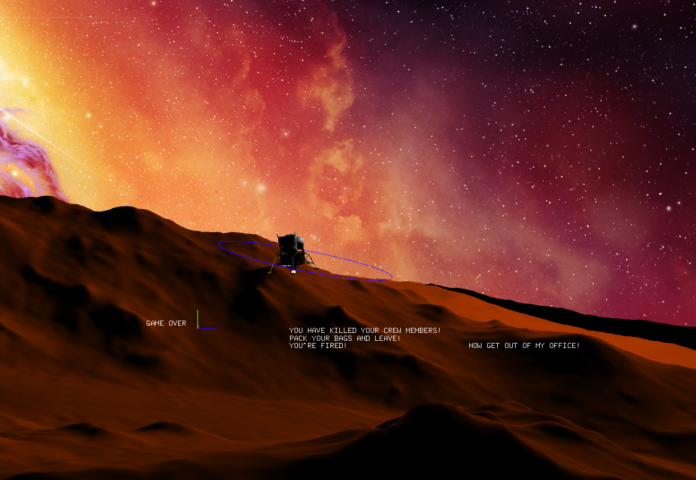

# CS134 MoonLanderProject
# About:
  This is a moon lander project designed in my Computer Game Design and Programming course at San Jose State University. It is programmed in C++ using OpenGL's Openframeworks. 
  
  The goal of the game is to land your vehicle within the blue circle without running out of fuel or crashing.   

# Game Controls
* Spacebar - starts game
* i : move foward
* k : move backwards
* j : move left
* l : move right
* q : move down
* w : move up
* t : increase thurst
* y: decrease thrust
* o : rotate left
* p : rotate right
# How to launch this game
  Locate the bin folder after cloning this repository and run Lab6SpatialPartioning_debug 

# Screenshots

  Start Screen
 

  Winning Screen
 

 
  Game Over Screen
 

# Youtube Video Demonstration
  https://www.youtube.com/watch?v=-2oysFGgXRA&ab_channel=thomaslao
    
  
  
  
